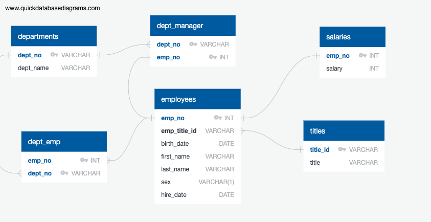
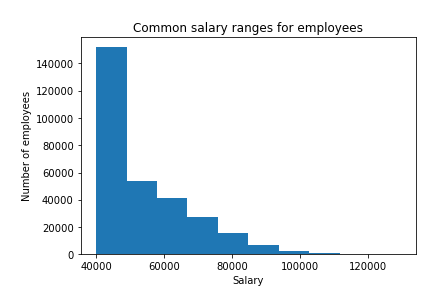
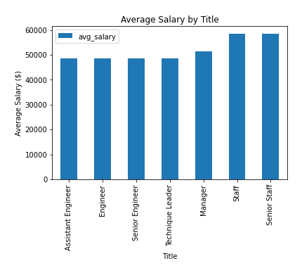

# sql-challenge

> Application of the skills learned about Data Engineering and Data Analysis using SQL

## Table of contents
* [General info](#general-info)
* [Graphs](#Graphs)
* [Observations](#Observations)
* [Vacation Results](#Vacation-Results)
* [Setup](#setup)
* [Status](#status)
* [Contact](#contact)

## General info
Research project on employees of Pewlett Hackard from the 1980s and 1990s based on six CSV files.

## Data Engineering
* Sketch ERD of the tables

* Create a table schema for each of the six CSV files and import each CSV file into the corresponding SQL table
    
## Data Analysis
1. List the following details of each employee: employee number, last name, first name, sex, and salary.

2. List first name, last name, and hire date for employees who were hired in 1986.

3. List the manager of each department with the following information: department number, department name, the manager's employee number, last name, first name.

4. List the department of each employee with the following information: employee number, last name, first name, and department name.

5. List first name, last name, and sex for employees whose first name is "Hercules" and last names begin with "B."

6. List all employees in the Sales department, including their employee number, last name, first name, and department name.

7. List all employees in the Sales and Development departments, including their employee number, last name, first name, and department name.

8. In descending order, list the frequency count of employee last names, i.e., how many employees share each last name.

## Bonus 
* Create a histogram to visualize the most common salary ranges for employees.

* Create a bar chart of average salary by title.

## Observations
* Salary for employee ID 499942.

## Contact
Created by [@deepavadakan](https://github.com/)