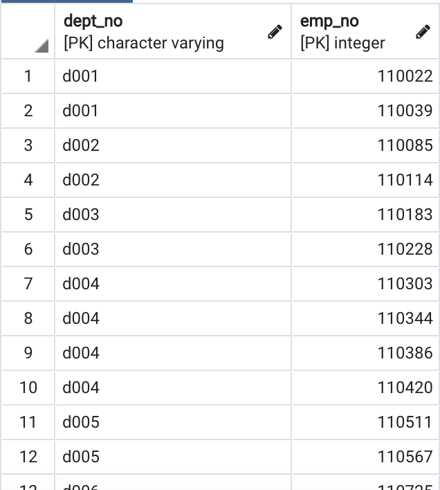
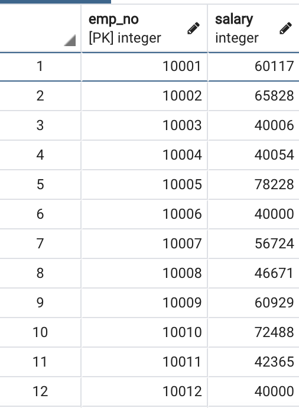

# sql-challenge

> Application of the skills learned about Data Engineering and Data Analysis using SQL


## Table of contents
* [General info](#General-info)
* [Data Engineering](#Data-Engineering)
* [Data Analysis](#Data-Analysis)
* [Bonus](#Bonus)
* [Observations](#Observations)
* [Contact](#Contact)

## General info
Research project on employees of Pewlett Hackard from the 1980s and 1990s based on six CSV files.

## Data Engineering
1. Sketch ERD of the tables


2. Create a table schema for each of the six CSV files and import each CSV file into the corresponding SQL table

    [Schema](EmployeeSQL/schema.sql)
    
<table>
  <tr>
    <td></td>
    <td></td>
    <td></td>
  </tr>
  <tr>
    <td></td>
    <td></td>
    <td></td>
  </tr>
</table>  

## Data Analysis
1. List the following details of each employee: employee number, last name, first name, sex, and salary.  
```sql
SELECT e.emp_no, e.last_name, e.first_name, e.sex, s.salary
        FROM employees AS e
    JOIN salaries AS s
        ON (e.emp_no = s.emp_no);
```
    
2. List first name, last name, and hire date for employees who were hired in 1986.  
```sql
SELECT first_name, last_name, hire_date
FROM employees
WHERE (hire_date >= '1/1/1986' AND hire_date <= '12/31/1986');
```

3. List the manager of each department with the following information: department number, department name, the manager's employee number, last name, first name.  
```sql
SELECT dm.dept_no, d.dept_name, dm.emp_no, e.last_name, e.first_name
FROM dept_manager AS dm
JOIN departments AS d
    ON dm.dept_no = d.dept_no
JOIN employees AS e
    ON dm.emp_no = e.emp_no;
```

4. List the department of each employee with the following information: employee number, last name, first name, and department name.  
```sql
SELECT de.emp_no, e.last_name, e.first_name, d.dept_name
FROM dept_emp AS de
JOIN departments AS d
    ON de.dept_no = d.dept_no
JOIN employees AS e
    ON de.emp_no = e.emp_no;
```

5. List first name, last name, and sex for employees whose first name is "Hercules" and last names begin with "B."  
```sql
SELECT first_name, last_name, sex
FROM employees
WHERE first_name = 'Hercules' AND last_name LIKE 'B%';
```

6. List all employees in the Sales department, including their employee number, last name, first name, and department name.
```sql
SELECT de.emp_no, e.last_name, e.first_name, d.dept_name
FROM dept_emp AS de
JOIN employees AS e
    ON de.emp_no = e.emp_no
JOIN departments AS d
    ON de.dept_no = d.dept_no 
WHERE d.dept_name = 'Sales';
```

7. List all employees in the Sales and Development departments, including their employee number, last name, first name, and department name.
```sql
SELECT de.emp_no, e.last_name, e.first_name, d.dept_name
FROM dept_emp AS de
JOIN employees AS e
    ON de.emp_no = e.emp_no
JOIN departments AS d
    ON de.dept_no = d.dept_no 
WHERE d.dept_name IN ('Sales','Development');
```

8. In descending order, list the frequency count of employee last names, i.e., how many employees share each last name.
```sql
SELECT last_name, COUNT(emp_no) AS "count"
FROM employees
GROUP BY last_name
ORDER BY count DESC;
```

## Bonus 
* Create a histogram to visualize the most common salary ranges for employees.  

  
* Create a bar chart of average salary by title.  


## Observations
* Salary for employee ID 499942: $40000

Hmmm! An Assistant Engineer, Engineer, Senior Engineer and Technique Leader all get about the same average salaries?


## Contact
Created by [@deepavadakan](https://github.com/)